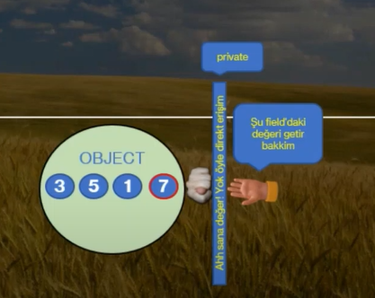

# Property

---

- Nesne içerisinde özellik / property sağlar.
- **Soru:** Peki nesne içerisinde özellik / property sağlaması ne demektir ?
- Property aslında özünde bir metottur. Yani programatik / algoritmik kodlarımızı inşa ettiğimiz bir metot.
- **Lakin fiziksel olarak metottan farklı parametre almamakta ve içerisinde get ve set olmak üzere iki adet blok almaktadır.**

```csharp
public int x 
{
    get 
    {
        return 0;
        // Sadece x değerinin bilgisi istendiği zaman get methodu devreye girer.
    }
    set
    {
        /*
        Eğer ki x değişkenine bir değer atandıktan sonra atanan 
        değer set içerisine gelir ve burada işlemler yapılır sonra 
        değeri gönderir. 
        */
    }
}
```

- Propert'nin işlevsel açıdan metottan farkı yoktur, lakin davranışsal olarak nesne üzerinde bir değer okuma ve değer atama işlemlerinde kullanılır.
- Keza bu bloklar compile neticesinde get ve set isimli metotlar olarak karrşımıza çıkmaktadır.
---
### Peki bu property ne demek?

- Eğer biz yazılımcılar nesnelerimiz içerisindeki field'lara direkt erişilmseini istemeyiz. 
- Dolaysıyla field'lar da ki kontrollü bir şekilde dışarıya açmak isteriz.
- işte böyle bir durumda metotları kullanabiliriz.
- 
- Kontrollü olarak ben verecem sen kafana göre alamazsın.
- Kısacası: İlgili field'da ki değerin hepsi yahut bir kısmı talep edene gönderilir. Böylece kontrol sağlanmış olur.
---
### Son sözler: 

- Böyle bir durumda C# programlama dilinde metot yerine property yapıarı gelişmiştir.
- Yani property yapıları özünde nesne içerisindeki bir field'ın dışarıya kontrollü açılmasını ve kontrollü bir şekilde dışarıdan değer almasını sağlayan yapılardır.