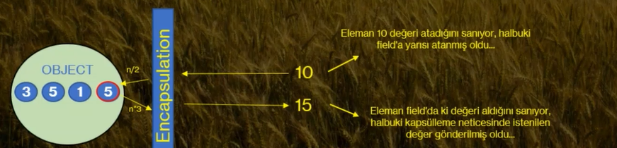

# Encapsulation (Kapsülleme/Sarmalama)

---

- Encapsulation, bir nesne içerisindeki dataların (field'lardaki verilerin dışarıya kontrollü bir şekilde açılması ve kontrollü bir şekilde veri almasıdır.)
- 
- işte bu şekilde field'larda ki verilerin erişim kontolünü yapmanız için geliştirilmiş olan yapılara Property denir.
- Biliyorum kısa anlatıldı cidden bu kadar basit :)