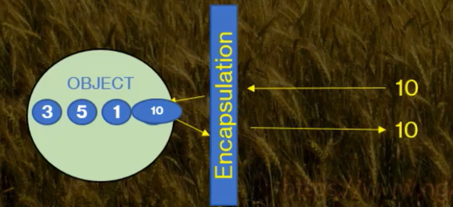

# Prop Property

---

- Bir property her ne kadar encapsulation yapsada temsil ettiği field'da ki dataya hiç müdahale etmeden erişilmesini ve veri atanmasını sağlıyorsa böyle bir durumda kullanılan property imzasıdır. 
- 
- Yukarıdaki görseli gördükten sonra aklına şu soru gelmiş olabilir: Böyle bir durumda direkt field'a erişim sağlasak! 
- Cevap: Hayır! Field'da ki değere müdahale olsun veya olmasın direkt erişim yapılmasını istemiyoruz. Bu alışkanlığımız olsun. Haliyle böyle bir durumda yine property kullanacağız. Sadece get ve set blokları aşağıdaki gibi tanımlanması yeterli olacaktır.  
```csharp
 [erişim belirleyicisi] [geri dönüş değeri] [property adı] {get; set;}
```
### Property Yapısı
- [erişim belirleyicisi] = public, private, protected, internal, protected internal ve private protected olmak üzere 6 farklı erişim belirleyici vardır.
- [geri dönüş değeri] = int, string, bool, double vb. herhangi bir veri tipi olabilir.
- [property adı] = Pascal Case kuralına göre isimlendirilir (örn: FirstName, Age)

---

## Kısa bir örnek

```csharp
    class MyClass 
{
    int age;
    
    
    /*
    public int Age 
    {
        get 
        {
            return age; 
        }
        
        set 
        {
            age = value;
        }   
    }
    */
    
    /* 
    Yukarıdaki kullanım gereksizdir çünkü sadece get ile yaş istendiği zaman yaşı geri
    döndürüyorsun veya age üzerine değer atandığı zaman set ile atanmış değeri "Adi"
    değişkeninin üzerine kaydediyorsun.
    Bunun yerine Prop property kullanımı daha iyidir!
    */
    
    // Prop property
    publıc int Age { get; set; }
    // Bu kısa yazım da yukarıdaki uzun hali ile aynısını yapmaktadır ve daha kısa halidir.
}
```
- aklına şu soru gelmiş olabilir: Field atamadım nasıl oluyor compiler bunu işleyebiliyor ?
- Cevap: Compiler zaten otomatik olarak field değeri atıyor kendi içerisinde.

--- 
## Kısa ve son söz
- Eğer ki bu durumda işlem yapacaksan ve kendi field'nı kullanacaksan property kullanmayacaksın eğer ki kendi property'ni kullanacaksan field kullanmayacaksın. 