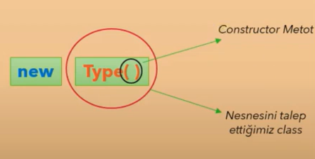

# new Operatörü İle Nesne Oluşturma

--- 

- C#'ta nesne üretimi için new operatörü kullanılır. 
- Bu operatörü kullandığınız zaman, sen bana 1 tane nesne oluştur ben bu değişken üzerinde kullanacağım anlamında kullanılır. 



Bir nesne oluşturma işlemi şu şekilde gerçekleşir: Type() (Tür) bir sınıftır ve nesnesini oluşturmak istediğimiz sınıfı temsil eder. Parantez açıp kapatarak sınıfın constructor (yapıcı) metodunu çağırırız. Constructor metotlar hakkında daha detaylı bilgiyi ileride ele alacağız. Şimdilik bunun bilinmemesi bir sorun oluşturmaz.

```csharp
using System; 

namespace example 
{
    class Program 
    {
        static void Main () 
            {
                new MyClass(); // <---- Nesneyi bu şekide oluşturduk
            }
    }
    
   class MyClass 
    {
    public int A {get; set;}
    public void X () {}
    }
}
```
Yukarıdaki kodda ilk nesnemizi oluşturduk. Derleyici new ifadesini gördüğünde bunu yeni bir nesne oluşturma komutu olarak algılar. Daha sonra, hangi türden bir nesne oluşturulacağını belirlemek için Type() yani türü girmeniz gerekir.

Bu oluşturulan nesne, RAM'in HEAP bölümüne atanır. Örneğin, Type türünde bir obje oluşturulacak ve bu obje HEAP'te yer alacaktır. Bu nesneye, örneğin, "Ali" gibi bir isim verilebilir.

## Peki Nesneyi Nasıl Erişip Kullanırız?

Bu noktada şu soru aklınıza gelmiş olabilir: "Tamam, bir nesne oluşturduk ama bu nesneye nasıl erişip kullanabiliriz?"

Bir nesneye erişmek için, önce STACK'teki bir referansı tanımlamanız gerekir. Bu referans, oluşturduğunuz nesneyi HEAP üzerinde işaret eder. Örneğin:

```csharp
MyClass x = new MyClass();
```

Bu ifadeyi inceleyelim:

- `MyClass`, tanımlayacağımız nesnenin türüdür.
- `x`, `MyClass` türündeki referans değişkenimizin adıdır. Bu isim `x` olmak zorunda değildir, herhangi bir isim seçebilirsiniz. Örneğin, `int a = 784` ifadesindeki `a`, bir `int` referansıdır. Aynı mantık burada da geçerlidir.
- `=` operatörü, burada "assign (atama)" görevinde değildir. Bunun yerine, STACK'teki referansın HEAP'teki nesneyi işaret etmesini sağlar. Bu sayede, STACK'teki `x` referansı üzerinden HEAP'teki nesneye erişim sağlayabilir ve üzerinde işlemler gerçekleştirebilirsiniz.
- `new MyClass();`, oluşturduğumuz nesnenin kendisidir.

Bu süreç, `=` operatörünün STACK ile HEAP arasında nasıl bir ilişki kurduğunu anlamamızı sağlar. Özetle, `x` referansını kullanarak nesnenize erişebilir ve işlem yapılabilir.
