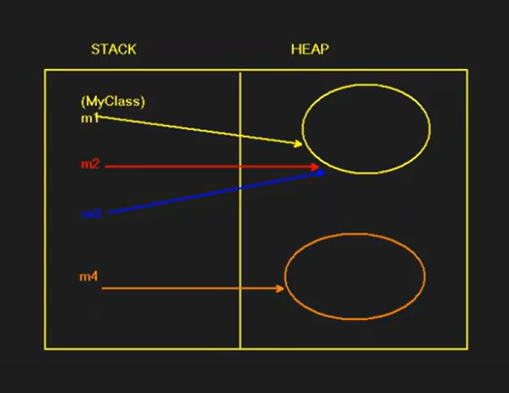
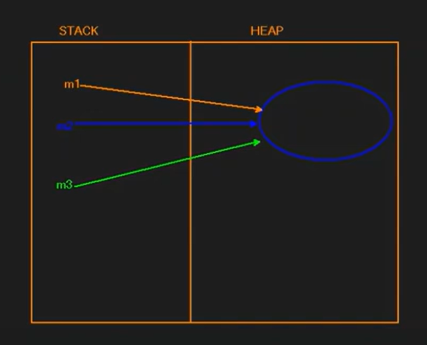

# Shallow Copy (Yüzeysel Kopyalama)

---

- **Shallow Copy**, bir nesnenin veya değerin yalnızca referansının kopyalanması işlemidir. Bu durumda, nesnenin kendisi çoğaltılmaz; yalnızca aynı nesne birden fazla referansla işaretlenir.

---

### Örnek-1

```csharp
using System; 
class Program
{
    static void Main () 
    {
        MyClass m1 = new MyClass(); // Yeni bir nesne oluşturuluyor
        MyClass m2 = m1;            // m2, m1'in referansını alıyor
        MyClass m3 = m2;            // m3 de aynı nesneye işaret ediyor
        MyClass m4 = new MyClass(); // Yeni bir nesne oluşturuluyor
    }
}

class MyClass
{
    // Basit bir sınıf tanımı
}
```

---

### Görsel Açıklaması



- **m1** objesi HEAP'te oluşturuluyor. Daha sonra:
    - **m2**, **m1**'in referansını alır ve aynı HEAP bölgesine işaret eder.
    - **m3**, **m2** ile aynı referansı kullanır ve yine aynı **m1** nesnesine bağlıdır.
    - **m4**, yeni bir nesne oluşturulduğu için HEAP'te farklı bir bellek alanına işaret eder.

Bu durumda:
- **m1**, **m2** ve **m3**, aynı nesneyi işaret eder.
- Bu bir **Shallow Copy** örneğidir. **Shallow Copy**'de nesnenin kendisi çoğaltılmaz; sadece referanslar kopyalanır.

---

### Örnek-2

```csharp
using System; 
class Program
{
    static void Main () 
    {
        MyClass m1 = null;         // null değeri atanır ve HEAP üzerinde bir anlamı yoktur.
        MyClass m2 = new MyClass(); // Yeni bir nesne oluşturuluyor
        MyClass m3 = m2;           // m3, m2'nin referansını alıyor.
        m1 = m3;                   // m1 de aynı nesneye işaret ediyor
    }
}

class MyClass
{
    // Basit bir sınıf tanımı
}
```

---

### Görsel Açıklaması



- **m1** başlangıçta `null` olarak tanımlanır. Bu nedenle ilk başta HEAP üzerinde bir nesneye işaret etmez.
- **m2**, `new MyClass()` ile yeni bir nesne oluşturur ve HEAP'teki bir bellek alanına işaret eder.
- **m3**, **m2**'nin referansını alır ve aynı HEAP bölgesine işaret eder.
- **m1**, **m3**'ün referansını aldığı için aynı HEAP nesnesine işaret eder.

Bu durumda:
- **m1**, **m2** ve **m3** aynı nesneyi işaret ettiği için yine bir **Shallow Copy** örneği görülmektedir.

---

### Deep Copy ile Farkı

- **Deep Copy**'de, orijinal nesnenin bağımsız bir kopyası oluşturulur. Kopya nesne farklı bir bellek alanında saklanır ve orijinal nesneyle tamamen bağımsızdır.
- **Shallow Copy**'de, bir nesneye yapılan değişiklik onu işaret eden tüm referanslar tarafından görülebilir. Ancak **Deep Copy**'de, bu tür bir etkileşim olmaz.

Özet olarak:
- **Shallow Copy**'de, referanslar paylaşılır ve aynı nesneye işaret eder.
- **Deep Copy**'de, her iki nesne farklı bellek alanlarında saklanır.
