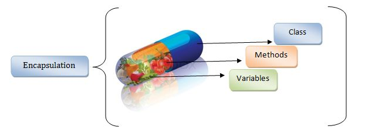

# Encapsulation

---

Encapsulation, nesne yönelimli programlamada (OOP) önemli bir kavramdır. Temel olarak, bir nesnenin iç durumunu (fields) korumak ve bu duruma kontrollü erişim sağlamak anlamına gelir. Bu sayede, nesnenin iç yapısı dışarıya kapalı kalır ve sadece belirli yöntemlerle erişime izin verilir.

## Neden Encapsulation?

- **Kontrol**: Nesnenin iç verilerine erişimi kontrol edebilirsiniz. Örneğin, bir değerin belirli bir aralıkta olmasını sağlayabilirsiniz.
- **Esneklik**: İç yapıyı değiştirirken, dışarıya açılan arayüzü değiştirmek zorunda kalmazsınız.
- **Güvenlik**: Dışarıdan yapılabilecek yanlış müdahaleleri engelleyebilirsiniz.

### Örnekle Açıklama

Bir ev düşünelim. Evin içinde değerli eşyalar var. Bu eşyaları korumak için evin çatısı, duvarları ve kapısı var. Kapıyı açmadığınız sürece kimse içeri giremez. İşte Encapsulation da tam olarak bu şekilde çalışır. Nesnenin içindeki verilere (eşyalara) doğrudan erişimi engeller ve kontrollü bir şekilde erişim sağlar.



## C#'da Encapsulation

C#'da Encapsulation iki temel yöntemle uygulanır:

1. **Metot ile Encapsulation**
2. **Property ile Encapsulation**

### 1. Metot ile Encapsulation

Metot ile Encapsulation, bir nesnenin iç verilerine erişimi metotlar aracılığıyla kontrol etmektir. Bu yöntemde, verilere doğrudan erişim yerine, getter ve setter metotları kullanılır.

#### Örnek:

```csharp
public class Person
{
    private string name;
    private int age;

    public Person(string name, int age)
    {
        this.name = name;
        SetAge(age); // Yaş atamasını kontrollü bir şekilde yapıyoruz.
    }

    public void SetAge(int age)
    {
        if (age > 0 && age < 120) // Yaşın mantıklı bir aralıkta olmasını sağlıyoruz.
        {
            this.age = age;
        }
        else
        {
            throw new ArgumentException("Invalid age value.");
        }
    }

    public int GetAge()
    {
        return age;
    }

    public string GetName()
    {
        return name;
    }
}
```

### Kullanım Örneği:

```csharp
Person person = new Person("Ali", 25);
Console.WriteLine($"{person.GetName()} is {person.GetAge()} years old.");

// Geçersiz yaş değeri denemesi
try
{
    person.SetAge(150);
}
catch (ArgumentException ex)
{
    Console.WriteLine(ex.Message);
}
```
Bu örnekte, `SetAge` metodu ile yaş değerinin mantikli bir aralıkta olmasını sağlıyoruz. Bu sayede, yaş değerine doğrudan erişim engellenmiş oluyor.

### 2. Property ile Encapsulation

Property ile Encapsulation, C#'da daha modern ve yaygın kullanılan bir yöntemdir. Property'ler, getter ve setter metotlarını daha okunabilir ve kullanışlı hale getirir.

#### Örnek:

```csharp
public class BankAccount
public class Product
{
    private string name;
    private double price;

    public Product(string name, double price)
    {
        this.name = name;
        Price = price; // Fiyat atamasını kontrollü bir şekilde yapıyoruz.
    }

    public string Name
    {
        get { return name; }
    }

    public double Price
    {
        get { return price; }
        private set
        {
            if (value >= 0) // Fiyatın negatif olmamasını sağlıyoruz.
            {
                price = value;
            }
            else
            {
                throw new ArgumentException("Price cannot be negative.");
            }
        }
    }

    public void ApplyDiscount(double discountRate)
    {
        if (discountRate > 0 && discountRate <= 1)
        {
            Price *= (1 - discountRate);
        }
        else
        {
            throw new ArgumentException("Invalid discount rate.");
        }
    }
}
```

### Kullanım Örneği:

```csharp
Product product = new Product("Laptop", 1000);
Console.WriteLine($"{product.Name} costs {product.Price} USD.");

// İndirim uygulama
try
{
    product.ApplyDiscount(0.1); // %10 indirim
    Console.WriteLine($"After discount, {product.Name} costs {product.Price} USD.");
}
catch (ArgumentException ex)
{
    Console.WriteLine(ex.Message);
}

// Geçersiz fiyat denemesi
try
{
    Product invalidProduct = new Product("Invalid Product", -100);
}
catch (ArgumentException ex)
{
    Console.WriteLine(ex.Message);
}
```

Bu örnekte, `Price` property'si ile fiyat değerinin negatif olmamasını sağlıyoruz. Ayrıca, `ApplyDiscount` metodu ile ürün fiyatına indirim uyguluyoruz.

