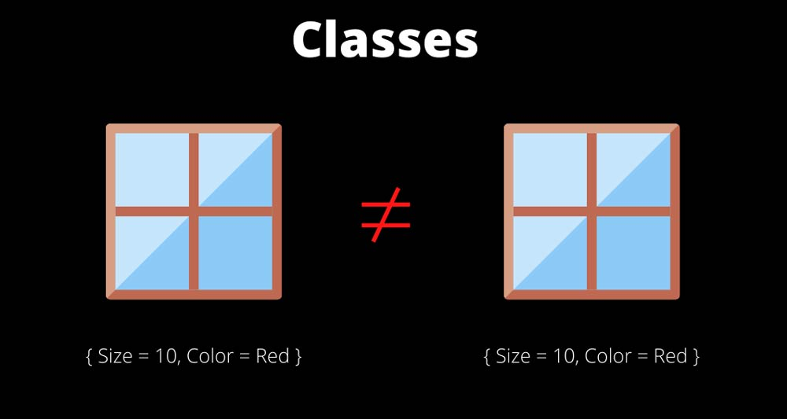
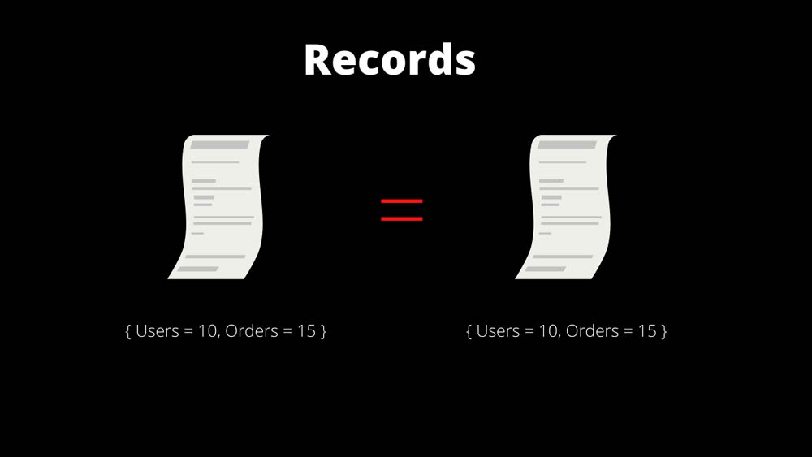

# Record

---

- Records aslında class'ın ta kendisi sadece belirli noktalarda ön yüze çıkması gereken **nesne** mi ya da **değer** mi sorusunun cevabı `değer` ise ve çalıştığınız alan nesnenin içerisindeyse aklımıza `Records` kavramı gelmeli.
- **C# 9.0** ile gelen [Init Only Properties](../30%20-%20Init%20Only%20Properties/README.md) özelliği, nesne üretim esnasının dışında değiştirilemez değerler olşturulması için constructor ve [Automatically Property Initializers](../14%20-%20Automatically%20Property%20Initializers/README.md) yapısının yanında Object Initializer yapısının kullanılabilir olmasını sağlıyordu.
---
> - Eğer ki tek bir property'de `Sabitlik / Değişmemezlik / Salt Okunulabilirlik` **amaç ediliyorsa** [Init Only Properties](../30%20-%20Init%20Only%20Properties/README.md) özelliği kullanılır.
> - Eğer ki bir objeyi bütünsel olarak değişmez yapmak istiyorsak o zaman daha fazlasına ihtiyacımız olacaktır. işte bu ihtiyaca istinaden `Records türü` geliştirilmiştir.

---

- Record bir nesnenin topyekün olarak `sabit/değişmez` olarak kalmasını sağlamakta ve bu durumu güvence altına almaktadır.
- Böylece bu obje, artık değeri değişmeyeceğinden dolayı esasında objeden ziyade bir değer gözüyle bakılan bir yapıya dönüşmektedir. 
- Buradan yola çıkarak record'ları içerisinde data barındıran **lightweight(hafif)** class'lar olarak değerlendirebiliriz.
- **Record'lar, class'lara istinaden objeden ziyade içerisinde bulunduran dataları sabitleyerek, nesneden ziyade `verilerinizi / datalarınızı` öne çıkarmaktadır.**
- Record'lar özünde bir class'tır. Sadece nesnelerinden ziyade, diğerleri ön plana çıkmış bir class.

---

### Class


> - Class'lar da verisel okarak nesne ön plandadır ve bir farklı referansa sahip olan nesne farklı değer olarak algılanmaktadır.
> - Dolayısıyla `Equals(x, y)` karşılaştırması yanlıştır.
> 
>

---

### Record

> - Recordlar ise verisel olarak değeri ön planda tutmaktadır. Sadece nesnel olarak bu veriler bir objede tutulmakta lakin değiştirlmemektedir.
> - Haliyle farklı objelerde de olsa, verileri (property değerleri) aynı olduğu sürece `Equals(x, y)` önermesi doğru olacaktır.
> 
> 

---

## Record Tanımlama

```csharp
MyClass m1 = MyClass() { MyProp = 31 };
MyClass m2 = MyClass() { MyProp = 31 };

Console.WriteLine(m1.Equals(m2)); // False

MyRecord r1 = MyRecord() { MyProp = 31 };
MyRecord r2 = MyRecord() { MyProp = 31 };

Console.WriteLine(r1.Equals(r2)); // True


record MyRecord 
{
    public int MyProp {get; init;}
}

class MyClass 
{
    public int MyProp {get; set;}
}

```
- Aslında göründüğü kadarıyla çok bir fark yok classlar ile sadece işin içine **değer'i** önemseyecek bir işlem yapıyorsanız kullanabilirsiniz. 
- Ha şu sakın aklınıza gelmesin değiştirilebilir özellik ekleyemiyoruz gelmesin!
- Değiştirilebilir özellik ve alanlara sahip kayıtlar da oluşturabilirsiniz.
```csharp
record MyRecord 
{
    public int X {get; set;}
    public int Y {get; set;}
}
```
- **NOT:** Kayıtlar değiştirilebilir olsa da, esas olarak değişmez veri modellerini desteklemek için tasarlanmıştır.

---
## Önemli Senaryo

```csharp
Employee employee1 = new Employee { Name = "otistik", Surname = "Cem", Position = 1};
Employee employee2 = new Employee { Name = employee1.Name, Surname = employee1.Surname , Position = 1};
```

- Bu tarz bir senaryoda ne kadar çok property o kadar zor ve maliyetli kod demektir. Elbette reflection veya serialization ile kopyalama mantıkları uygulanabilir. Yauhut bir auto mapping kullanabilirsiniz. Ama görüldürğü üzere bu tarz senaryolarda class'lar la çalışmak kaçınılmaz olacaktır.
- Bu sorunu çözmek için [With Expressions](../32%20-%20With%20Experessions/README.md) konusuna bakın. 